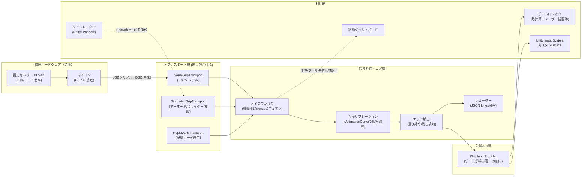

# 握力入力ブリッジ＆シミュレータ 設計書 兼 仕様書

**ツールID:** `GripInputBridge`
**対象プロジェクト:** 『握れ、灼ける前に』(Xx_MS2026_xX)
**対象Unityバージョン:** 6000.3.13f1 (Unity 6 / URP 17.3.0 / Input System 1.19.0 / Test Framework 1.6.0)
**文書バージョン:** v1.0（初版）
**最終更新:** 2026-09-12

---

## 目次

0. この文書について
1. 背景と目的
2. 用語集
3. ゴール／非ゴール
4. 全体アーキテクチャ
5. 機能要件一覧（MoSCoW）
6. ハードウェア／通信仕様
7. ソフトウェア設計詳細
8. シミュレータ機能仕様
9. UI/UX設計
10. データ保存・リプレイ・エクスポート
11. 診断・監視（本番運用向け）
12. 実装ステップ（フェーズ計画とレビューポイント）
13. コードレビュー運用ルール
14. テスト計画
15. 本番運用フロー（イベント当日）
16. リスクと対策
17. 今後の拡張余地
18. 付録：フォルダ構成案 / APIクイックリファレンス

---

## 0. この文書について

これは『握れ、灼ける前に』の企画書（一枚企画書＋地形候補比較）を踏まえ、開発の最優先ボトルネックである**「握力入力」をゲーム本体から切り離して扱うためのツール**の設計書兼仕様書です。

このツールが無いと、実機（握力センサー付きレーザー大砲コントローラー×4台）が完成するまでプログラマー・演出担当・バランス調整担当の誰もコア体験を触れず、開発が実質ストップします。逆にこのツールさえ最初に固めておけば、以降の全工程（VFX調整、リズムスキル判定、地形バランス調整、会場運営ツール）はハードウェアの完成を待たずに並行して進められます。**このプロジェクト全体の"最初の一枚岩"にあたる最重要ツール**という位置づけです。

対象読者：このプロジェクトの開発メンバー全員（プログラム未経験者を含む想定）。専門用語は初出時に必ず説明し、迷ったら [2. 用語集](#2-用語集) に戻れるようにしています。

---

## 1. 背景と目的

### 1.1 企画書からの要点整理

| 項目 | 内容 |
|---|---|
| コア操作 | 「握る」動作のみ。ボタンのON/OFFではなく**連続値（アナログ値）** |
| 握力%の意味 | レーザーの太さに直結する連続パラメータ |
| 熱の計算 | 熱 = 握力²の時間積分（オーバーヒートで自砲台が沈黙） |
| リズム要素 | 特定の「にぎる／はなす」パターンでスキル発動（キャラごとに異なる） |
| 公平性 | 握力の**相対値**を使うことで子供と大人が対等に対戦できる |
| 展示運用 | 来場者の最大握力を事前計測してカード記録、本日のランキング表示 |
| プレイ人数 | 4人同時（4台の物理コントローラー） |
| 場所 | 文化祭等の展示会場（実機・実運用が前提） |

### 1.2 このツールが解決する課題

- **開発のボトルネック解消**：実機ハードウェア（センサー＋マイコン）が無くても、キーボードやスライダーで握力入力を再現し、ゲーム側の実装・テストを止めない。
- **入力の品質保証**：生のセンサー値はノイズだらけで、そのままではゲームに使えない。フィルタリングとキャリブレーションを一箇所に集約し、ゲーム側は「0〜1の綺麗な値」だけを見ればよい状態にする。
- **公平性の実現**：「子供と大人が対等に対戦できる」を実現する握力の相対値化は、この入力層でしか正しく作れない（ゲームロジック側に散らばると事故る）。
- **本番の安定運用**：センサー断線・値の張り付き・Wi-Fi混雑など、展示当日に起きうる事故を検知し、フォールバックできるようにする。
- **不具合の再現性**：本番中に起きた「なぜかスキルが出なかった」を後から検証できるよう、入力を記録・再生できるようにする。

### 1.3 このツールの位置づけ（責務の境界）

このツールが**やること**：センサーからの生値取得 → ノイズ除去 → キャリブレーション（正規化）→ 0〜1の握力値として配信、握る/離すの検出、記録・再生、開発用シミュレータ、診断表示。

このツールが**やらないこと**：熱・オーバーヒートの計算、レーザー描画、スキル発動そのもの、キャラごとのリズムパターン定義（これらは別ツール／ゲームロジック側の責務。本ツールは「入力」を正しく渡すことだけに集中する）。

> **設計原則：入力は "誰が触っても同じ意味を持つ0〜1の値" として抽象化する。** これがブレると、後工程のVFX・スキル判定・バランス調整の全部がやり直しになる。

---

## 2. 用語集

| 用語 | 説明 |
|---|---|
| 生値（Raw Value） | センサーが実際に送ってくる、較正前・フィルタ前の数値。ノイズを含む。 |
| フィルタ値（Filtered Value） | 生値からノイズ（ガタつき）を取り除いた値。 |
| キャリブレーション（較正） | 個人差（握力の強い人・弱い人、大人・子供）を吸収し、誰でも0〜1の同じスケールに変換する処理。 |
| 正規化値（Normalized Value） | キャリブレーション後の最終出力。**ゲーム側が使うのはこれだけ**。0.0＝全く握っていない、1.0＝そのプレイヤーの最大握力。 |
| デッドゾーン | ごく小さい入力（誤差・ノイズ）を「0」とみなして無視する範囲。 |
| ヒステリシス | ON判定としきい値OFF判定の境界に「のりしろ」を持たせ、境界付近でのチャタリング（連続反転）を防ぐ仕組み。 |
| トランスポート（Transport） | 入力データがどの経路で届くかの抽象化（実機シリアル通信／シミュレータ／記録再生など）。 |
| プロバイダー（Provider） | ゲーム側が実際に呼び出す窓口。トランスポートが何であってもプロバイダーのAPIは変わらない。 |
| エッジ検出 | 値の「握り始め」「離し始め」の瞬間を検出すること。リズムスキル判定の入力になる。 |
| キャリブレーションプロファイル | プレイヤー1人分の最大握力・最小握力・応答カーブなどの設定データ。 |
| ホットスワップ | Play中でも入力元（実機／シミュレータ／記録再生）を再生成なしに切り替えられること。 |
| ウォッチドッグ | 一定時間データが来ない、あるいは値が張り付いている異常を自動検知する監視処理。 |

---

## 3. ゴール／非ゴール

### ゴール（このツールが満たすべきこと）

1. 4人分の握力入力を、実機の有無にかかわらず同じAPIで取得できる。
2. 実機が無い開発環境でも、キーボード／スライダー／波形プリセットで違和感なく開発・テストできる。
3. 個人差を吸収するキャリブレーションを、プログラムを触らず運用担当者が実行できる。
4. 「握り始め／離し」を安定して検出でき、リズムスキル判定の土台になる。
5. センサー異常（断線・張り付き・遅延）を自動検知し、画面上とログの両方でわかる。
6. 入力ログを記録・再生でき、バグ調査とバランス調整データ収集の両方に使える。
7. ツールの見た目・操作感が、初めて触るチームメンバーにも直感的にわかる。

### 非ゴール（このツールではやらないこと）

- 熱／オーバーヒートのゲームロジック計算（→ ゲームプレイ側の責務）
- レーザーVFXの描画・シェーダー調整（→ 別途提案した「レーザー/熱ビジュアル調整ツール」の責務）
- リズムパターンそのものの定義・スキル発動ロジック（→ 別途提案した「グリップリズム・スキル判定エディタ」の責務。本ツールは「握った/離した」というイベントを渡すところまで）
- 会場運営（ランキング表示・投票受付）（→ 別途提案した「会場運営ダッシュボード」の責務）

---

## 4. 全体アーキテクチャ



**レイヤーごとの責務**

| レイヤー | 責務 | 差し替え可能性 |
|---|---|---|
| トランスポート層 | 生データをどこから取得するか | ◎ 実機/シミュレータ/リプレイをホットスワップ |
| 信号処理・コア層 | ノイズ除去・較正・エッジ検出・記録 | ゲームロジックからは見えない内部処理 |
| 公開API層 | ゲームが実際に呼ぶ唯一の窓口 | ここだけ触ればゲーム側は完成する |
| 利用側 | ゲームロジック／デバッグUI／Input System | 入力元の実体を意識しない |

この構造により、**「今日は実機がまだ来ていないから、キーボードで代用してゲームを作る」→「実機が届いたらトランスポートを差し替えるだけ」**という開発フローが成立します。

---

## 5. 機能要件一覧（MoSCoW）

「あれば便利」を積極的に拾いつつ、優先度を明確にして手戻りを防ぎます。

### Must（無いとツールとして成立しない）

| ID | 機能 |
|---|---|
| M-01 | `IGripInputProvider.GetGripValue(playerIndex)` で4人分の正規化値(0-1)を取得できる |
| M-02 | シミュレータ（キーボード操作）で実機なしに0-1の値を生成できる |
| M-03 | ノイズフィルタ（移動平均 or EMA）を適用できる |
| M-04 | プレイヤーごとのキャリブレーション（最小/最大握力の記録と正規化） |
| M-05 | 握り始め／離しのエッジイベント（`OnGripStarted` / `OnGripReleased`） |
| M-06 | 実機シリアル通信からの入力取得（USB CDC） |
| M-07 | センサー切断・タイムアウトの検知とフォールバック |

### Should（品質を大きく左右するので早めに入れたい）

| ID | 機能 |
|---|---|
| S-01 | Editor Window（UI Toolkit）による見やすいシミュレータUI |
| S-02 | 4人分のライブ波形グラフ表示（生値/フィルタ値/正規化値を重ねて表示） |
| S-03 | キャリブレーションカーブをAnimationCurveで調整可能に（線形以外の応答も作れる） |
| S-04 | 波形プリセット（一定値・ランプ・パルス・そっと/しっかり/渾身の3段階プリセット） |
| S-05 | 入力ログの記録（JSON Lines）と再生（ReplayGripTransport） |
| S-06 | Unity Input System 用カスタムDeviceとしての統合（`GripCannonController`） |
| S-07 | Play Mode Tests によるフィルタ・キャリブレーション計算の自動テスト |

### Could（発展的・"あれば便利"枠。積極採用したいが後回し可）

| ID | 機能 |
|---|---|
| C-01 | シリアルポート自動検出＋ハンドシェイクによるプレイヤー自動割り当て（配線ミス防止） |
| C-02 | ノイズ/遅延シミュレーション注入（悪条件での動作確認用） |
| C-03 | センサー値が異常に張り付いた場合の自動アラート（ウォッチドッグ） |
| C-04 | CSVエクスポート（本日の来場者の握力統計など、会場運営ツールとの連携用） |
| C-05 | 設定プロファイルの複数保存（「開発用」「本番_9/12」など） |
| C-06 | ツール内蔵の「はじめに」タブ（初見の人向けの使い方説明） |
| C-07 | カラーブラインド配慮のプレイヤーカラー切り替え |
| C-08 | OSC（Wi-Fi経由）トランスポート（将来、無線コントローラー化する場合） |

### Won't（今回は明確にやらない）

| ID | 機能 | 理由 |
|---|---|---|
| W-01 | 振動モーターなどの触覚フィードバック制御 | 出力側の機能でありスコープ外。[17. 今後の拡張余地](#17-今後の拡張余地) に記載のみ |
| W-02 | クラウドへのログ自動アップロード | 会場にネット環境が保証されないため。ローカル保存を正とする |

---

## 6. ハードウェア／通信仕様

### 6.1 想定ハードウェア

- センサー：FSR（感圧センサー）またはロードセル＋アンプ（HX711等）を1人1系統、計4系統。
- マイコン：**ESP32系を推奨**（USBシリアルに加え将来Wi-Fi/OSC化の余地があるため）。Arduino Unoでもシリアル通信のみなら代替可。
- 接続：まずはUSBシリアル（有線）を正とする。無線化はC-08として将来検討。

### 6.2 シリアル通信プロトコル（案）

1行1メッセージのテキストプロトコルとする（デバッグのしやすさを優先）。

```
G,<player_index 0-3>,<raw_value 0-4095>,<device_timestamp_ms>\n
```

例：`G,0,2048,183920\n` … プレイヤー0番の生値2048（12bit ADC想定）、マイコン起動からの経過時間。

- 送信レート：**60Hz目安**（リズム判定のため十分な時間分解能を確保。過剰な高頻度はUSBバッファ溢れの原因になるため避ける）
- ハンドシェイク（C-01向け）：起動時にマイコンが `HELLO,<device_id>\n` を送り、PC側が `ASSIGN,<player_index>\n` を返すことでプレイヤー番号を動的に割り当てる。これにより「どのケーブルがどのプレイヤーか」を配線時に固定しなくてよくなる。
- ハートビート：200ms以上メッセージが来ない場合、そのプレイヤーは「切断」とみなす（6.3参照）。

### 6.3 異常系の扱い

| 異常 | 検知方法 | フォールバック |
|---|---|---|
| ケーブル抜け／マイコン電源断 | ハートビートタイムアウト(200ms) | 該当プレイヤーを「未接続」表示、シミュレータ入力に自動切替可能にする（C-03と連動） |
| センサー故障で値が張り付く | 一定時間（例:3秒）値の分散がほぼ0 | 警告表示。プレイ続行は可能だがスタッフに通知 |
| ノイズ過多 | フィルタ後も分散が閾値超え | フィルタ強度を自動的に一段階強める（オプション） |

---

## 7. ソフトウェア設計詳細

### 7.1 主要インターフェース

```csharp
// 生データの取得元を抽象化する
public interface IGripTransport
{
    bool IsConnected(int playerIndex);
    float GetRawValue(int playerIndex); // 0-1に正規化前の生値（機器依存レンジをここで0-1へ一次変換）
    event Action<int> OnConnected;
    event Action<int> OnDisconnected;
}

// ゲームが実際に呼び出す唯一の窓口
public interface IGripInputProvider
{
    float GetGripValue(int playerIndex);      // 0.0-1.0 正規化済み
    float GetRawValue(int playerIndex);        // デバッグ用（フィルタ前）
    bool IsGripping(int playerIndex);          // デッドゾーンを超えているか
    event Action<int> OnGripStarted;           // 握り始め（エッジ）
    event Action<int> OnGripReleased;          // 離した瞬間（エッジ）
    GripDeviceStatus GetStatus(int playerIndex); // 接続状態・異常フラグ
}

public enum GripDeviceStatus { Connected, Disconnected, Stale, Suspicious }
```

**なぜこの分離か**：ゲームプログラマーは `IGripInputProvider` だけを知っていればよく、トランスポートが実機かシミュレータかを一切気にしなくてよい。これにより「ハード班とゲーム班が並行作業できる」というこのツールの一番の目的が達成される。

### 7.2 信号処理パイプライン

1. **一次変換**：機器依存のレンジ（例：ADC 0-4095）を0-1へ変換。
2. **ノイズフィルタ**：以下から選択・併用可能に設計（`ScriptableObject`で切替可能なフィルタ設定）
   - 移動平均（Moving Average）：直近Nサンプルの平均。実装が簡単で安定。
   - 指数移動平均（EMA）：直近値を重視しつつ滑らかにする。反応速度と滑らかさのバランス調整がしやすい。
   - メディアンフィルタ：単発の外れ値（スパイクノイズ）に強い。
   - **推奨初期設定：EMA（係数0.3程度）＋ 3点メディアンの併用**（スパイクにもガタつきにも強い）
3. **デッドゾーン**：0.03未満は0とみなす（センサー個体差の暗電流ノイズ吸収）。
4. **キャリブレーション**：
   - 較正前生値 `v`、そのプレイヤーの最小値`min`・最大値`max`から
     `normalized = Clamp01((v - min) / (max - min))`
   - さらに**応答カーブ（AnimationCurve）**を通すことで、「そっと／しっかり／渾身」の3段階が企画書の意図通りの手応えになるよう調整可能にする（線形だと渾身域が窮屈に感じやすいため）。
5. **エッジ検出（ヒステリシス付き）**：
   - ON閾値0.12を超えたら`OnGripStarted`、OFF閾値0.08を下回ったら`OnGripReleased`（閾値を分けることでチャタリング防止）。

### 7.3 Unity Input System 連携（S-06）

握力入力を独自イベントだけで閉じず、**Unity標準のInput Systemの「カスタムデバイス」として登録**することで、将来的にInput Actionのリバインドや他の入力（デバッグ用ゲームパッド等）との共存が自然になる。

- `GripCannonController : InputDevice` を定義し、`grip0`〜`grip3`を`AxisControl`として公開。
- `InputSystem_Actions.inputactions`（既存アセット）に `Grip` アクションマップを追加し、この独自デバイスをバインド可能にする。
- 開発中はシミュレータがこのカスタムデバイスに値を書き込み、本番では実機トランスポートが同じデバイスに書き込む。ゲームコード視点では変化なし。

### 7.4 データモデル（ScriptableObject）

```
GripCalibrationProfile (ScriptableObject)
├─ playerIndex : int
├─ minRawValue : float
├─ maxRawValue : float
├─ responseCurve : AnimationCurve
├─ deadZone : float
└─ lastCalibratedAt : string (ISO8601)

GripFilterSettings (ScriptableObject)
├─ filterType : enum (MovingAverage, EMA, Median, EMA+Median)
├─ windowSize : int
├─ emaAlpha : float
├─ onThreshold : float
└─ offThreshold : float

GripDeviceConfig (ScriptableObject)
├─ serialPortName : string
├─ baudRate : int
├─ heartbeatTimeoutMs : int
└─ autoAssignPlayerIndex : bool
```

すべてScriptableObjectにすることで、**「本番当日用の設定」「開発用の設定」をアセットとして複数保存し、切り替えるだけで運用できる**（C-05に対応）。

---

## 8. シミュレータ機能仕様

### 8.1 入力方式

| 方式 | 操作感 | 用途 |
|---|---|---|
| キーボード（ホールド） | キーを押している間だけ値が上昇、離すと減衰 | 手軽な動作確認 |
| Editor上のスライダー | マウスでドラッグして任意の値に固定 | 特定の値での挙動確認（例：熱ゲージの見た目確認） |
| 波形プリセット再生 | 一定値／ランプ／パルス／ランダム を自動再生 | リズムスキル判定や耐久試験 |
| 記録データ再生 | 過去に記録した実プレイのログを再生 | 回帰テスト・バグ再現 |

### 8.2 デフォルトキー割当（案）

| プレイヤー | 握るキー | 対応色 |
|---|---|---|
| P1 | <kbd>Q</kbd>（ホールド） | 赤 |
| P2 | <kbd>W</kbd>（ホールド） | 青 |
| P3 | <kbd>O</kbd>（ホールド） | 緑 |
| P4 | <kbd>P</kbd>（ホールド） | 黄 |

キーを押している時間が長いほど値が上昇し、離すと一定速度で減衰させることで、実際の「握り続けると強くなり、離すと緩む」感触に近づける（単純なON=1/OFF=0にしない）。

### 8.3 波形プリセット（企画書の「そっと／しっかり／渾身」に対応）

- **そっと**：0.2〜0.3を維持
- **しっかり**：0.5〜0.6を維持
- **渾身**：0.9〜1.0を維持しオーバーヒートを誘発
- **リズムテスト用パルス**：4分音符ベースで「にぎる・にぎる・(休符)・はなす」等、企画書のスキル発動譜面を模したON/OFFパターンを再現し、リズムスキル判定側の検証に使えるようにする。

### 8.4 ホットスワップ

Editor再生中でも、シミュレータUIの上部にあるドロップダウンで「実機 / シミュレータ / 記録再生」を切り替え可能（Play Modeを止めなくてよい）。実機接続時に問題が起きても、その場でシミュレータに逃がして開発を継続できる。

---

## 9. UI/UX設計

「見やすさ最優先・オシャレ・初見でもわかる」を満たすため、レガシーIMGUIではなく**UI Toolkit（UXML/USS）**でEditor Windowを構築する。

### 9.1 デザイン方針

- **配色**：Unity Editor Pro Skinのダーク基調に合わせ、アクセントカラーのみプレイヤーカラー（赤・青・緑・黄）で統一。全ツール（シミュレータ／診断／将来の会場運営ダッシュボード）で同じプレイヤーカラーを使い回し、どの画面を見ても「これはP1の情報」と直感的にわかるようにする。
- **タイポグラフィ**：見出し／本文／数値表示でフォントサイズ・太さを明確に区別。数値は等幅フォントで桁がズレないようにする。
- **余白**：詰め込みすぎない。4人分の情報を横に並べても窮屈にならないよう、パネル間に十分なマージンを確保。
- **アイコン**：接続状態は色付きドット（緑=接続中／灰=未接続／赤=異常）を左上に統一配置。文字だけでなく視覚的に一瞬で状態がわかるようにする。

### 9.2 画面構成（Editor Window: `Grip Input Bridge`）

```
┌─────────────────────────────────────────────────────────┐
│ [はじめに] [シミュレータ] [キャリブレーション] [診断] ← タブ切替 │
├─────────────────────────────────────────────────────────┤
│ 入力元: [●実機 / ○シミュレータ / ○記録再生 ▼]   [● REC]    │
├─────────────────────────────────────────────────────────┤
│  P1(赤) 🟢接続中          P2(青) 🟢接続中                  │
│  ┌───────────────┐      ┌───────────────┐               │
│  │ 生値グラフ      │      │ 生値グラフ      │               │
│  │ フィルタ後グラフ │      │ フィルタ後グラフ │               │
│  │ 正規化値グラフ  │      │ 正規化値グラフ  │               │
│  ├───────────────┤      ├───────────────┤               │
│  │ ▮▮▮▮▮▯▯▯ 62%  │      │ ▮▮▯▯▯▯▯▯ 24%  │  ← 大きい数値表示 │
│  │ [波形: 渾身 ▼]  │      │ [波形: そっと ▼] │               │
│  └───────────────┘      └───────────────┘               │
│  P3(緑) ⚪未接続          P4(黄) 🔴異常（値が張り付き）      │
│  ...                     ...                              │
├─────────────────────────────────────────────────────────┤
│ ⓘ 各項目にカーソルを合わせると説明が表示されます              │
└─────────────────────────────────────────────────────────┘
```

- **「はじめに」タブ（C-06）**：ツールを初めて開いた人向けに、①入力元の選び方 ②キャリブレーションのやり方 ③診断の見方、を3ステップで図解する固定ページ。ここを見れば誰でも迷わず使える状態を目指す。
- 全てのラベル・数値・ボタンに**ツールチップ**（マウスホバーで説明）を必須で付与する。UI Toolkitの`tooltip`プロパティを全コントロールに設定するのをコーディング規約に含める（[13章](#13-コードレビュー運用ルール)のレビュー観点に追加）。
- 数値は「62%」のように単位付きで大きく表示し、生の0.62のような小数値だけを表示しない（非エンジニアが見て意味がわかることを優先）。

### 9.3 キャリブレーションタブ

運用担当者（非エンジニア）が本番前に実行する想定。手順をウィザード形式にする：

1. 「プレイヤーを選択」→ 2. 「最大握力で3秒握ってください」というガイド表示とカウントダウン → 3. 自動で`maxRawValue`を記録 → 4. 応答カーブのプレビュー（グラフでどう変化するか即座に見える）→ 5. 「保存」

このウィザード形式にすることで、コードや数値の意味を理解していなくても迷わず較正が完了する。

### 9.4 診断タブ

- 4人分の接続状態・最終受信時刻・推定レイテンシ・パケットレートを一覧表示。
- 異常（切断/張り付き）が出た行を赤くハイライトし、上部に警告バナーを表示。

---

## 10. データ保存・リプレイ・エクスポート

### 10.1 保存フォーマット

**JSON Lines（1行1サンプル）** をログ形式として採用（ストリーミング書き込みがしやすく、途中で異常終了してもそこまでのデータが壊れない利点があるため）。

```jsonl
{"t":183920,"p":0,"raw":0.51,"filtered":0.49,"normalized":0.62}
{"t":183937,"p":1,"raw":0.20,"filtered":0.21,"normalized":0.24}
```

保存先：`Assets/../GripLogs/YYYYMMDD_HHmmss_session.jsonl`（プロジェクト直下の`Docs`と対で`GripLogs`フォルダを用意。ただしAssets配下だとUnityがインポートしようとするため、実際には**プロジェクトルート直下の`GripLogs/`（Assets外）**に出力し、.gitignore対象とすることを推奨）。

### 10.2 リプレイ

`ReplayGripTransport`が上記ログを読み込み、記録時と同じタイミングで`IGripTransport`経由の値を再生する。バグ報告時に「このログを再生すれば同じ状況を再現できる」状態を作ることで、展示当日の不具合調査が格段に楽になる。

### 10.3 CSVエクスポート（C-04）

会場運営ツール（将来）で「本日の来場者の握力統計」を使えるよう、セッションごとの最大値・平均値をCSVに変換するユーティリティも用意する（本ツールのMust要件ではないが、データ形式の設計時点でこの用途を意識しJSON Linesを選定している）。

---

## 11. 診断・監視（本番運用向け）

- 接続状態・異常フラグは[7.1のAPI](#71-主要インターフェース)から取得でき、ゲーム画面側にも小さく表示できるようにイベントを公開する（例：ゲーム内の「スタッフ用オーバーレイ」がこのAPIを購読して警告を出す）。
- ウォッチドッグ（C-03）：同一値が3秒以上続いた場合に`GripDeviceStatus.Suspicious`を返す。これにより「握りっぱなしで壊れた」のか「センサー故障で張り付いている」のかをスタッフが判別しやすくする。

---

## 12. 実装ステップ（フェーズ計画とレビューポイント）

**方針：各フェーズの最後に必ずコードレビューのゲートを設け、次フェーズへは「レビュー合格後」にのみ進む。** フェーズは小さく区切り、常に「今動くもの」がある状態を維持する。

### Phase 0：技術検証（スパイク）
- **目的**：実現性の不安要素を先に潰す。
- **やること**：ESP32(またはArduino)とUnity間のUSBシリアル最小疎通確認、Unity 6でのUI Toolkit Editor Window最小サンプル作成、Input System カスタムDeviceの最小サンプル作成。
- **成果物**：疎通確認メモ（このDocs配下に追記でよい）。
- **完了条件**：シリアルで1個の数値がUnityに届くことを確認できた。
- 🔍 **レビューポイント**：本実装ではないため軽量レビュー（相談ベースでOK）。

### Phase 1：コア抽象層とシミュレータ最小実装（MVP）
- **目的**：ハードウェア無しでも4人分のダミー入力が得られる状態を最速で作る（最優先）。
- **やること**：`IGripTransport` / `IGripInputProvider` インターフェース定義、`SimulatedGripTransport`（キーボードのみ、UIはIMGUIの仮実装でよい）、`GetGripValue()`が動作。
- **成果物**：キーボードで4人分の握力をシミュレートできる状態。
- **完了条件**：サンプルシーンでQ/W/O/Pキーを押すと対応する値が0-1で変化し、離すと減衰する。
- 🔍 **レビューポイント**：
  - [ ] インターフェースの命名・責務分離は7.1の設計と齟齬がないか
  - [ ] `GetGripValue`がPlay中フレーム毎に呼ばれてもGCアロケーションが発生しないか
  - [ ] マジックナンバー（減衰速度など）が設定値として外出しされているか

### Phase 2：フィルタリング＆キャリブレーション
- **目的**：ノイズ除去と個人差吸収のロジックを実機接続前に固める（シミュレータにノイズ注入機能(C-02)を先に足して検証する）。
- **やること**：EMA/メディアンフィルタ実装、`GripCalibrationProfile`実装、キャリブレーション計算の単体テスト作成。
- **成果物**：`GripFilterSettings`アセットで挙動を切り替えられる状態。
- **完了条件**：Play Mode Testsでフィルタ・キャリブレーションの計算が期待値と一致する。
- 🔍 **レビューポイント**：
  - [ ] フィルタ係数（EMA alpha等）が調整しやすい形で公開されているか
  - [ ] 0除算・NaN混入などの境界値が考慮されているか（max==minのときなど）
  - [ ] 単体テストが境界値を含めてカバーしているか

### Phase 3：実ハードウェア接続
- **目的**：実機（届き次第）とシミュレータをシームレスに切り替えられるようにする。
- **やること**：`SerialGripTransport`実装（6.2のプロトコル準拠）、ハートビート監視、切断検知とフォールバック。
- **成果物**：実機接続時にPhase1-2で作ったAPIがそのまま使える状態。
- **完了条件**：ケーブルを抜き差ししてもクラッシュせず、切断状態が正しく表示される。
- 🔍 **レビューポイント**：
  - [ ] シリアル通信の例外処理（ポートが無い・権限エラー等）が握りつぶされずログに残るか
  - [ ] メインスレッドをブロックしない設計になっているか（別スレッド/非同期読み取り）
  - [ ] 6.3の異常系表がすべて実装済みか

### Phase 4：Input System統合＆エッジ検出
- **目的**：リズムスキル判定側が使う「握り始め/離し」イベントを提供し、Input Systemとの統合を完了する。
- **やること**：`GripCannonController : InputDevice`実装、`OnGripStarted`/`OnGripReleased`のヒステリシス付きエッジ検出。
- **成果物**：InputActionsアセットからGrip値を参照できる状態。
- **完了条件**：波形プリセット「リズムテスト用パルス」を再生し、期待通りの回数だけエッジイベントが発火する。
- 🔍 **レビューポイント**：
  - [ ] ヒステリシス閾値がScriptableObjectで調整可能か
  - [ ] イベントの多重発火・取りこぼしがないか（テストで境界の値を送って確認）

### Phase 5：記録・再生＆診断ダッシュボード
- **目的**：本番のトラブルシュートとバランス調整データ収集の基盤を作る。
- **やること**：JSON Linesレコーダー実装、`ReplayGripTransport`実装、診断タブ（接続状態一覧・警告バナー）実装。
- **成果物**：セッション記録→再生の一連の流れが動作。
- **完了条件**：記録したログを再生して同じグラフ推移が再現できる。
- 🔍 **レビューポイント**：
  - [ ] ログファイルの書き込みがフレーム毎の同期I/Oでスパイクを起こしていないか（バッファリング/非同期書き込み）
  - [ ] 記録ファイルの命名規則・保存先が[10.1](#101-保存フォーマット)と一致しているか

### Phase 6：UI/UXポリッシュ
- **目的**：「初見でもわかる・オシャレ」を実際に満たす。
- **やること**：UI ToolkitでのUXML/USS本実装、プレイヤーカラー統一、ツールチップ全項目付与、「はじめに」タブ作成、キャリブレーションウィザード化。
- **成果物**：9章の画面構成通りのEditor Window。
- **完了条件**：開発に関わっていないメンバー（例：演出担当や1年生部員）に触ってもらい、説明なしで「入力元の切り替え」と「キャリブレーション実行」ができることを確認する（簡易ユーザビリティテスト）。
- 🔍 **レビューポイント**：
  - [ ] 全てのUI要素にtooltipが設定されているか（コーディング規約チェック）
  - [ ] 配色がプレイヤーカラー統一ルールに沿っているか
  - [ ] ダークテーマ/ライトテーマどちらのEditorでも視認性が保たれるか

### Phase 7：統合テスト・実機リハーサル
- **目的**：本番同様の4台同時接続で長時間安定動作するかを確認する。
- **やること**：4台同時接続での長時間稼働試験、ケーブル抜き差し試験、会場を想定したWi-Fi/電源環境での動作確認。
- **成果物**：リハーサル記録（発生した不具合と対処のログ）。
- **完了条件**：[14章のテスト計画](#14-テスト計画)のチェックリストが全て緑になる。
- 🔍 **レビューポイント**：全フェーズを通した最終レビュー。設計書からの逸脱があれば本書を更新する。

---

## 13. コードレビュー運用ルール

学生チームでの運用を想定し、負荷が重すぎない形にする。

- **頻度**：各フェーズの完了時（上記12章の🔍マーク時点）に必ず1回実施。加えて、1つのPR/コミット単位が大きくなりそうな場合は途中でも都度依頼してよい（1週間以上レビューなしで実装を続けない）。
- **レビュー方法**：チームの人数的にメンバー同士の相互レビューを基本とする（1人しかいない場合は「翌日、自分で読み返す」セルフレビューを最低ラインとし、チェックリストは同じものを使う）。
- **共通チェックリスト**（全フェーズ共通で必ず確認）：
  - [ ] 命名がこの設計書の用語集（[2章](#2-用語集)）と一致しているか
  - [ ] 本ツールの非ゴール（[3章](#3-ゴールノンゴール)）に該当する責務が紛れ込んでいないか（例：熱計算ロジックが誤ってこのツール内に書かれていないか）
  - [ ] 例外・null・0除算などの境界値が握りつぶされず処理されているか
  - [ ] Update()等の毎フレーム処理でGCアロケーションが発生していないか
  - [ ] 追加した公開APIにXMLドキュメントコメント（`///`）が付いているか
  - [ ] UIを変更した場合、ツールチップ・配色ルールが守られているか（9章）
- **レビュー記録**：Pull Requestのコメント欄、もしくは簡易に済ませたい場合はチームのチャットログでも可。ただし「誰が・いつ・何を見た」が後から追えることを最低条件とする。

---

## 14. テスト計画

| テスト種別 | 対象 | 方法 |
|---|---|---|
| 単体テスト（Edit Mode） | フィルタ計算、キャリブレーション計算、エッジ検出のヒステリシス判定 | `com.unity.test-framework`（導入済み）のNUnitベースEdit Mode Tests |
| Play Modeテスト | シミュレータ入力→`IGripInputProvider`出力の一致確認 | Play Mode Tests。波形プリセットを入力し期待値と比較 |
| 実機結合テスト | シリアル通信の安定性、切断復帰 | 実機を意図的に抜き差ししながら1時間runする耐久試験 |
| ユーザビリティテスト | UIの分かりやすさ | 非開発メンバーに触ってもらい、説明なしで操作できるか観察（Phase 6完了条件） |
| 本番リハーサル | 4台同時・長時間稼働 | 会場と同等の電源・配線環境で最低2時間の連続稼働試験 |

---

## 15. 本番運用フロー（イベント当日）

1. **開場前セットアップ**：4台のコントローラーを配線 → ツールの診断タブで4台すべて「接続中」になることを確認。
2. **キャリブレーション実施**：来場者ごと、または開場前にスタッフでキャリブレーションウィザードを実行（企画書の「列に並んでいる人に最大握力を図ってもらい」に対応する場合は、この結果をそのまま`GripCalibrationProfile`として一時保存する運用も想定）。
3. **通常稼働中の監視**：診断タブ（またはゲーム内スタッフオーバーレイ）で常時警告バナーを監視。
4. **異常発生時のフォールバック**：センサー故障を検知したら、該当プレイヤーの入力元をその場でシミュレータ（スタッフがスライダー操作）に切り替え、体験を止めずに応急対応する。
5. **閉場後**：その日のセッションログ（JSON Lines）を保存・回収し、翌日の調整や報告に使う。

---

## 16. リスクと対策

| リスク | 影響 | 対策 |
|---|---|---|
| センサーのノイズが想定より大きい | 意図しないスキル誤爆、値のガタつき | フィルタ強度を設定値として外出し（[7.2](#72-信号処理パイプライン)）、本番前に現地で微調整できるようにする |
| 会場のWi-Fi混雑 | 無線化した場合の遅延・パケットロス | 初期実装は**有線シリアルのみ**とし、無線化(C-08)は本番実績を見てから検討する |
| 子供と大人で最大握力の差が大きすぎる | キャリブレーションのレンジが極端になり操作感が破綻 | 応答カーブ（AnimationCurve）で調整可能にし、本番前のリハーサルで複数人の握力データを集めて調整する |
| 汗・湿気によるセンサー誤作動 | 展示中に値が不安定になる | ウォッチドッグ（C-03）で異常検知し、フォールバック手順（15章）で対応 |
| 開発メンバーの入れ替わり・引き継ぎ | 設計意図が失われる | 本書と用語集を常に最新化し、コードのXMLドキュメントコメントを必須化（13章） |

---

## 17. 今後の拡張余地

- **触覚フィードバック**：オーバーヒート時に振動モーターでコントローラーを震わせるなど、出力側の演出（W-01で今回は対象外としたが、次期作あるいは本作の追加演出として有望）。
- **無線化（OSC/Wi-Fi）**：C-08。配線の取り回しが会場設営のボトルネックになる場合に検討。
- **複数会場・複数セット同時運用**：文化祭以外のイベント出展等でセットを増やす場合、プレイヤー番号の割り当て範囲を拡張する設計にしておくと流用しやすい。
- **会場運営ダッシュボードとの連携**：本ツールのCSVエクスポート（C-04）を、別途提案した会場運営ダッシュボードの「本日の握力ランキング」表示にそのまま食わせる想定。

---

## 18. 付録

### 18.1 フォルダ構成案

```
Assets/
  _Tools/
    GripInputBridge/
      Runtime/
        Transports/        (IGripTransport, SerialGripTransport, SimulatedGripTransport, ReplayGripTransport)
        Processing/         (フィルタ, キャリブレーション, エッジ検出)
        InputSystem/        (GripCannonController カスタムDevice定義)
        Provider/           (GripInputProvider 実装)
        Data/               (GripCalibrationProfile, GripFilterSettings, GripDeviceConfig の ScriptableObject定義)
      Editor/
        GripInputBridgeWindow/  (UI Toolkit Editor Window: UXML/USS/C#)
      Tests/
        EditMode/
        PlayMode/
GripLogs/                 (Assets外・.gitignore対象。記録ログの出力先)
Docs/
  Tools/
    GripInputBridge_設計仕様書.md   (本書)
```

### 18.2 APIクイックリファレンス

```csharp
// ゲームコード側からの典型的な使い方
float grip = GripInputBridge.Provider.GetGripValue(playerIndex); // 0.0-1.0
bool isGripping = GripInputBridge.Provider.IsGripping(playerIndex);

GripInputBridge.Provider.OnGripStarted += (playerIndex) => {
    // リズムスキル判定側に「握り始めた」タイミングを通知
};
GripInputBridge.Provider.OnGripReleased += (playerIndex) => {
    // 同上、「離した」タイミング
};

var status = GripInputBridge.Provider.GetStatus(playerIndex);
if (status == GripDeviceStatus.Suspicious) {
    // スタッフ向け警告表示など
}
```

---

*本書はPhase 0開始前のレビューをもって最終化とし、以降の設計変更は各フェーズのレビュー時にこのファイル自体を更新すること（設計書とコードの乖離を防ぐため）。*
